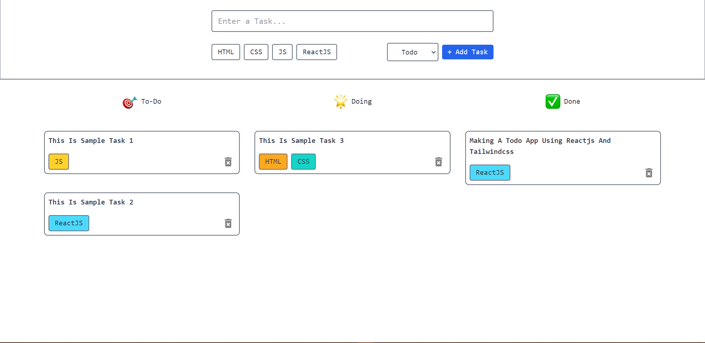

# React Todo App

A responsive to-do application built with ReactJS and Tailwind CSS. This app features a modern design and includes essential functionalities such as adding, deleting tasks, tagging tasks, drag and drop, and local storage integration.



## Features

- **Modern Design**: The app boasts a modern user interface designed with ReactJS and Tailwind CSS, providing a seamless user experience.
- **Responsive**: The application is fully responsive, ensuring compatibility across various devices and screen sizes.
- **Local Storage**: Tasks are stored locally, allowing users to access their to-do list even after closing the browser.
- **Drag and Drop**: Users can easily rearrange tasks using drag and drop functionality for better organization.
- **Deleting Tasks**: Remove tasks effortlessly with the built-in delete functionality.
- **Tagging Tasks**: Add tags to tasks for better categorization and organization.

## Installation

1. Clone the repository:

   ```bash
   git clone https://github.com/your-username/react-todo-app.git
   ```

2. Navigate to the project directory:

   ```bash
   cd react-todo-app
   ```

3. Install dependencies:
   ```bash
   npm install
   ```

4. Start the development server:
   ```bash
   npm run dev
   ```

5. Open your browser and visit http://localhost:5173 to view the app.

## Usage

- **Adding Tasks**: Click on the "+ Add Task" button to add a new task. Enter the task details and press Enter to save.
- **Deleting Tasks**: Hover over a task and click on the delete icon to remove it from the list.
- **Tagging Tasks**: Assign tags to tasks by clicking on the tag icon and entering the tag name.
- **Drag and Drop**: Rearrange tasks by dragging and dropping them to the desired position.
